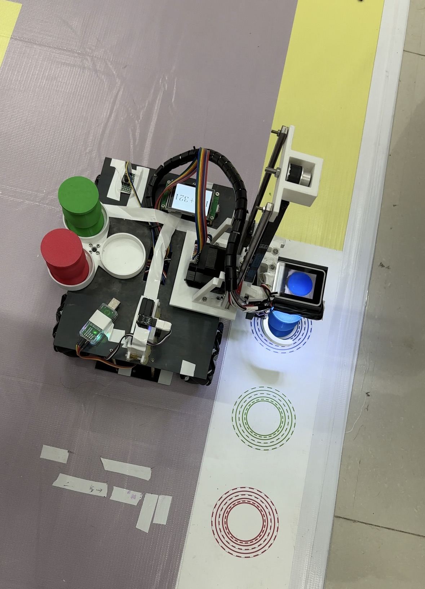

# STM32F407 Engineering-Training Logistics Robot

[简体中文](README.md) | [English](README.en.md)

> An engineering-training logistics robot featuring multi-UART DMA communication, closed-loop stepper control, actuator coordination, and a servo state machine.



## Overview

The project was developed for an engineering-training logistics task. The current archive verifies STM32F407 communication, closed-loop stepper drivers, multi-motor addressing, homing, and discrete servo control. The main application still contains integration-stage traces, so this repository clearly separates implemented control modules from the not-yet-documented full logistics mission.

```text
Host commands / sensors
          ↓
UART DMA + Receive-to-Idle
          ↓
FIFO / command parsing
          ↓
Addressed closed-loop steppers + 270° servo
```

## Hardware and Modules

- STM32F407ZGT6 at 168 MHz.
- USART1/2/3/6 with DMA-based reception.
- Multiple addressed closed-loop stepper drivers.
- TIM2 PWM for a 270-degree servo.
- FIFO buffering between communication and application logic.

| Path | Responsibility |
| --- | --- |
| `firmware/Core/` | CubeMX initialization and application entry |
| `firmware/Emm_V5/` | Closed-loop stepper-driver protocol |
| `firmware/motor_control/` | Address, position, speed, and synchronized motion |
| `firmware/derives_servo/` | Discrete servo-angle state machine |
| `firmware/instruct/` | Homing request and completion polling |
| `firmware/fifo/` | UART receive buffering |

## Build Entry

1. Open `firmware/GX_02.ioc` with STM32CubeMX.
2. Verify the clock, UART, DMA, and timer configuration.
3. Open the Keil project under `firmware/MDK-ARM/`.
4. Confirm motor addresses, direction, pulse ratios, limits, and emergency-stop behavior before powering actuators.
5. Validate homing, jog motion, position control, and safe servo angles separately.

## Evidence Boundary

The source demonstrates the communication and actuator modules. The available material does not yet prove that navigation, perception, pickup, placement, and long-duration logistics cycles passed final acceptance. Those claims require mission documents, wiring, a frozen firmware version, and physical test records.
